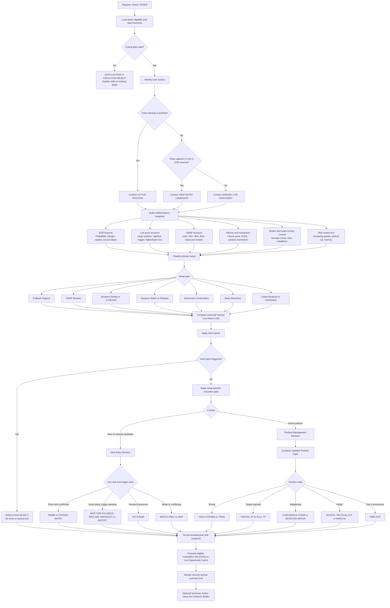
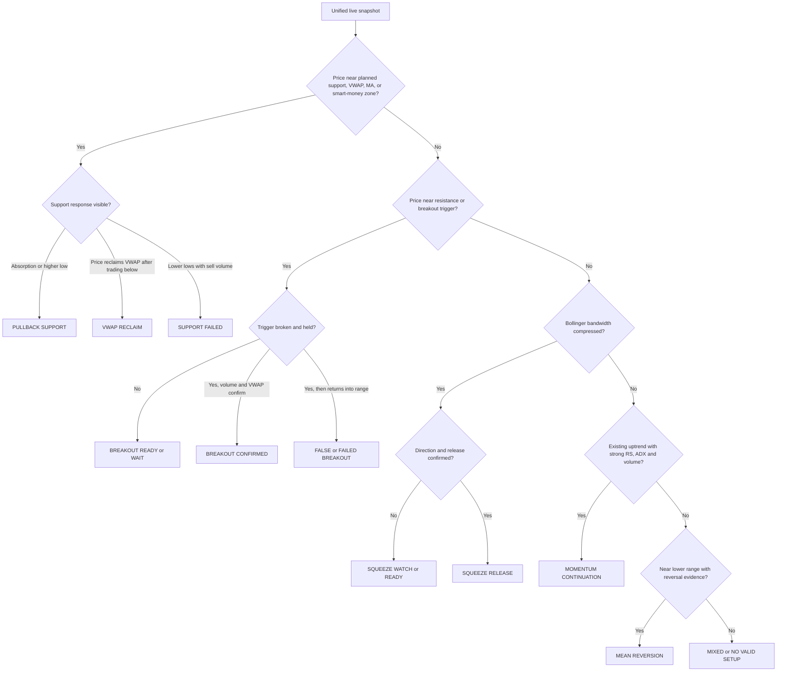
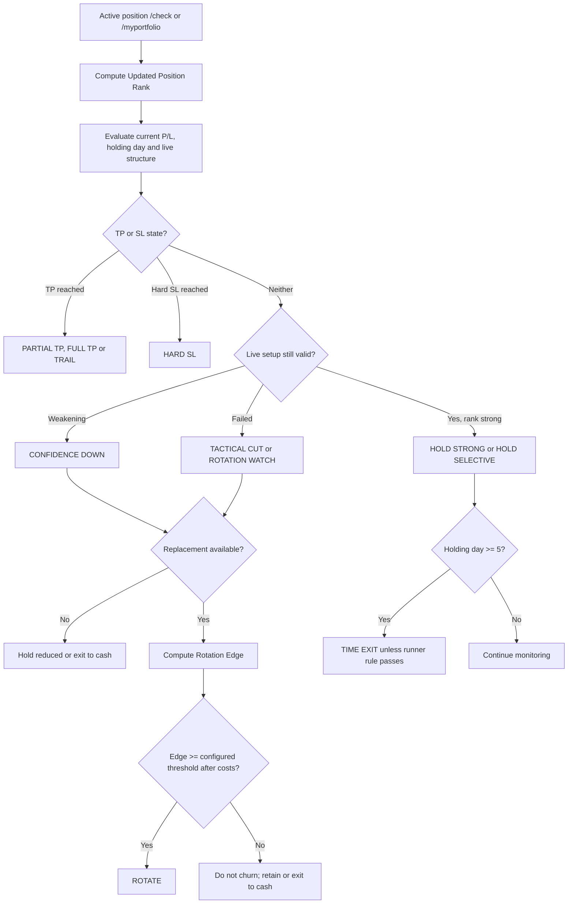

# MBSS v3.17 AB-RC2 Final Implementation and Research Specification

## Backbone Top-8, Consensus Brief, Explosive Lane, and RapidAPI Enrichment

**Status:** Claude-ready consolidated implementation and research specification  
**Baseline:** MBSS scoring formula v3.17.0  
**Primary universe:** seluruh saham syariah eligible setelah whitelist dan liquidity eligibility  
**Primary validation window:** 1 June–12 August 2026  
**Historical RapidAPI policy:** no backfill; forward enrichment only

---

## 1. Objective

Implement a shared EOD backbone that ranks the broad Sharia universe before results are delivered into the two primary scanners:

1. `/screendaytrade`
2. `/hc`

`/consensus` becomes the concise user-facing brief. It summarizes the highest-quality overlap between both scanners, adds a controlled Explosive Lane, and appends RapidAPI smart-money and multibagger context when available.

`/gptpick` remains available, but it is downstream from the same backbone and is not the primary user brief.

`/executiongate` is not part of the new workflow. `/check TICKER` is the live confirmation tool.

---

## 2. Target Architecture

```text
Nightly EOD cache, broad Sharia universe
        ↓
Feature Engine v3.17
RSI, ADX, MACD, CMF, OBV, Bollinger Bands,
V5 Breakout, Continuation, Activity, VolQ,
Room, Safety, RR, volatility, relative strength
        ↓
Global Market Regime, one regime per date
R1 / R2 / R3 / R4 / R5
        ↓
BACKBONE
Danger Gate → Probability Rank → Top-8 Moderate
        ↓
Primary scanners
/screendaytrade          /hc
        ↓                   ↓
        └────── /consensus brief ──────┐
                                       ├─ Consensus Prime
                                       ├─ Explosive Lane, 1–3 names
                                       ├─ Smart-Money Overlay
                                       └─ Long-Horizon Multibagger Info
        ↓
/check TICKER for live confirmation
```

---

## 3. Backbone Definition

### 3.1 Danger Gate

The strongest validated function of the research model is dangerous-loss control. The gate must be evaluated before any primary scanner ranks its candidates.

Inputs should include:

- `day_range_pct_10d`
- `risk_reward_at_max`
- V5 Safety / `risk_score`
- RSI
- Activity
- Breakout extension
- Room
- volume ratio
- market regime
- bearish OBV divergence
- MACD bearish cross
- below SMA50 / EMA21
- near-price-floor flag

The initial production cutoff should implement the **moderate gate frozen from discovery data**, not a threshold re-tuned daily. Store both:

```text
predicted_danger
passed_danger_gate
```

If the statistical model is not shipped in production, first implement an auditable deterministic approximation from the same factors and retain the fields above for later calibration.

### 3.2 Probability Ranking

After candidates pass the Danger Gate, rank using:

- Continuation quality
- CMF / money-flow direction
- ADX trend reliability
- relative strength versus IHSG
- MACD state and freshness
- Bollinger context
- Safety
- VolQ
- Room
- RR
- continuous volatility position, including P90 context
- market-regime compatibility

P90 is part of the backbone, not merely a display badge. Do not implement it as a universal hard AND-filter because that makes output too sparse and was not stable across all periods.

### 3.3 Output Size

```text
Target: Top 8
Acceptable normal range: 5–8
Never fill with bad candidates just to reach quota
```

When fewer than five candidates pass the gate, return fewer than five and state that market quality is limited.

---

## 4. Regime Policy

The regime is **market-wide**, normally based on IHSG/breadth context, and applies equally to all tickers for that signal date. Individual ticker behaviour remains represented by its own technical features.

Suggested posture:

- **R1 Bull Stable:** more offensive; preserve breakout, relative-strength and upside winners.
- **R2 Bull High Vol:** highly selective until sufficient forward sample exists.
- **R3 Sideways:** use the validated moderate gate; this was the strongest near-current regime.
- **R4 Risk Off:** lower confidence and reduced output, but not automatic no-trade.
- **R5 Stress:** strict risk control; prefer `/screendaytrade` opportunities over HC-only names when evidence conflicts.
- **R0/insufficient:** no high-confidence recommendation. Show data-quality warning.

---

## 5. Primary Scanner Behaviour

### 5.1 `/screendaytrade`

- Receives the backbone candidate pool.
- Retains its Fresh Breakout, Continuation and Accumulation lane logic.
- Main source of large-upside opportunities.
- Must not fetch RapidAPI data live for the full universe.

### 5.2 `/hc`

- Receives the same backbone candidate pool.
- Applies High Conviction structural checks.
- Primarily acts as quality/structure confirmation.

### 5.3 `/gptpick`

- May re-rank the backbone pool using its existing formula.
- Must not independently re-open the entire universe.
- Preserve source tracking for later evaluation.

---

## 6. `/consensus` User Brief

### 6.1 Consensus Prime

Definition:

```text
passed Backbone Top-8
AND selected by /screendaytrade
AND selected by /hc
on the same signal date
```

Display all qualifying names, usually 0–2. Do not weaken the definition to force output.

Suggested label:

```text
🏆 CONSENSUS PRIME
```

Near-current validation result:

```text
n = 19
win rate = 68.42%
average return = +1.13%
median return = +1.67%
dangerous loss <= -10% = 0%
worst loss = -9.01%
```

### 6.2 Explosive Lane

Add **1–3 names**, potentially from outside final `/screendaytrade` and `/hc` output, provided they are still from the Sharia eligible universe and pass a looser but meaningful safety gate.

Primary factors:

1. Room high
2. RR high
3. Controlled but meaningful volatility
4. Activity strong
5. Not heavily extended or chased

Breakout and Continuation are confirmations, not dominant explosive predictors.

Hard-reject examples:

- near-price-floor risk
- very poor RR
- strong bearish OBV divergence
- bearish MACD cross combined with below SMA50
- extreme volatility beyond allowed tail
- heavy chase/extension
- missing/insufficient market regime

Soft penalties only:

- moderately high RSI
- above-median volatility
- isolated volume spike
- not selected by HC
- Safety below Probability Core but not structurally dangerous

Suggested label:

```text
🚀 EXPLOSIVE LANE
```

### 6.3 Smart-Money Overlay

Do not backfill RapidAPI. The nightly job sweeps the configured broker whitelist, captures their top net-buy activity, and intersects it with scanner candidates.

Required behaviour:

```text
RapidAPI unavailable → bonus 0, penalty 0
```

Suggested tiers:

- Consensus Prime + smart-money net buy → `💎 TRIPLE CONFIRMATION`
- Explosive candidate + smart-money net buy → `🚀 EXPLOSIVE + SMART MONEY`
- Strong smart-money accumulation without scanner confirmation → `💰 SMART-MONEY WATCH`, informational only
- Strong technical setup + whitelist net sell → `⚠️ SMART-MONEY DIVERGENCE`

Bonus inputs:

- number of whitelist brokers net buying
- aggregate whitelist net-buy percentage/value
- concentration
- persistence across available snapshots
- proximity to broker average entry
- whether price is still unextended

All bonus values must be bounded so broker data cannot rescue a fundamentally poor or danger-rejected ticker.

### 6.4 Long-Horizon Multibagger

RapidAPI multibagger results are displayed separately because the horizon differs from the 1–5 day scanner outcome.

Suggested label:

```text
🔭 LONG-HORIZON WATCH
```

Show at most 1–2 names with:

- multibagger score
- potential-return label
- horizon
- whether also present in Backbone, SDT, HC or Consensus

Do not materially blend this score into the short-horizon decision.

---

## 7. Suggested `/consensus` Message Format

```text
📊 MARKET REGIME
R3 SIDEWAYS
Posture: selective; prioritize risk control and healthy room.

🏆 CONSENSUS PRIME
1. ABCD
   Backbone: 82
   SDT: PRIORITY FRESH
   HC: 6/7
   Smart Money: ZP, BK net buy
   Status: TRIPLE CONFIRMATION

🚀 EXPLOSIVE LANE
1. EFGH
   Explosive: 78
   Room: 84 | RR: 2.4 | Activity: 81
   Risk: aggressive but passed explosive safety gate
   Action: run /check EFGH before entry

💰 SMART-MONEY WATCH
1. MNOP
   Whitelist net buyers: YU, AK
   Technical confirmation: not yet
   Status: pre-breakout watch, not an entry call

🔭 LONG-HORIZON WATCH
1. QRST
   Multibagger: 82/100
   Horizon: 6–12 months
   Also in HC: yes
```

---

## 8. Tracking Schema

Persist these fields when the brief is generated:

```text
signal_date
ticker
market_regime
backbone_score
probability_score
predicted_danger
passed_danger_gate
backbone_rank
sdt_selected
sdt_lane
hc_selected
hc_score
consensus_prime
explosive_score
explosive_selected
smart_money_bonus
smart_money_brokers
smart_money_net_pct
smart_money_divergence
multibagger_score
final_display_tier
entry_plan
tp1
cut_loss
formula_version
```

Outcome horizons:

- Consensus and Explosive: Day 1–5
- Smart-money overlay: compare enriched versus unenriched forward cohorts
- Multibagger: Day 30, 60, 90 and 180

---

## 9. Implementation Plan for Claude Agent

### Phase 1: Shared backbone module

Create a dedicated module, preferably:

```text
engine/backbone.py
```

Responsibilities:

- compute danger score
- apply gate
- compute probability score
- apply regime adjustment
- rank Top-8
- compute Explosive Score
- produce serializable explanations

Keep all calculations deterministic and unit-testable.

### Phase 2: Nightly integration

In `engine/nightly.py`:

1. Run scoring for the full eligible Sharia universe.
2. Compute and persist market regime.
3. Run backbone against the complete EOD results.
4. Save backbone pool and metadata in a dedicated cache partition.
5. Run RapidAPI sweeps only through existing quota-protected nightly functions.
6. Save smart-money and multibagger context separately.

Suggested cache partitions:

```text
backbone_daily
rapidapi_smartmoney
rapidapi_market_intelligence
```

### Phase 3: Primary scanners

In `commands/scan.py`:

- `/screendaytrade` reads `backbone_daily` instead of independently selecting from the full cache.
- `/hc` reads the same backbone pool.
- `/gptpick` reads the same backbone pool.
- Preserve existing scanner-specific scoring after the backbone.

### Phase 4: Consensus brief

Refactor `/consensus` so it:

1. Loads Backbone Top-8.
2. Computes SDT and HC results on the same pool.
3. Finds exact same-date intersection.
4. Selects 1–3 Explosive Lane candidates.
5. Applies RapidAPI smart-money overlay.
6. Appends multibagger information.
7. Outputs concise sections in the required order.

### Phase 5: `/check` integration

`/check` remains the live validation tool and should show:

- VWAP movement 15/30/60
- active breakout
- volume pace
- trigger/invalidation
- Bollinger context
- smart-money context if cached
- clear action: enter/watch/wait/avoid, without invoking full executiongate

### Phase 6: Tests

Required tests:

```text
test_backbone_danger_gate.py
test_backbone_ranking.py
test_explosive_lane.py
test_consensus_intersection.py
test_smartmoney_bonus_bounds.py
test_rapidapi_missing_is_neutral.py
test_multibagger_separate_horizon.py
test_scanners_use_same_backbone_pool.py
```

Acceptance criteria:

- no live RapidAPI fetch from bulk scanner command
- no candidate outside Sharia eligible universe
- missing RapidAPI never penalizes candidate
- Consensus Prime is exact SDT ∩ HC intersection
- Explosive Lane max 3 and passes minimum safety rules
- Top-8 is derived before scanner-specific ranking
- source and formula version are tracked
- existing Telegram commands still compile and register

---

## 10. Three-Day Simulation

The simulation uses a Top-8 moderate gate trained/frozen from the 2025 discovery period and evaluated on clean historical outcomes. Entry is the next trading-day open. TP/SL outcomes are monitored for up to five trading days.

### 10.1 Signal date: 31 July 2026

**Regime:** R1 Bull Stable  
**Consensus Prime:** SIMP

```text
SIMP
Entry: 3 Aug 2026 @ 610
TP1: 645
SL: 540
Outcome: time-based loss
Exit: 10 Aug 2026 @ 595
Return: -2.46%
Holding period: 5 trading days
```

Top-8 day summary:

```text
Wins: UCID, ERAA, BIRD
Losses: KPIG, MPMX, SIMP, DMAS, BUDI
Win rate: 37.5%
Consensus-only win rate: 0% (n=1)
```

Important interpretation: Consensus is high quality in aggregate, not guaranteed on each date. SIMP did not hit TP or SL within five days and closed at the time limit.

### 10.2 Signal date: 30 July 2026

**Regime:** R1 Bull Stable  
**Consensus Prime:** AALI and SMSM

```text
AALI
Entry: 31 Jul 2026 @ 6,875
TP1: 7,220
SL: 6,250
Outcome: TP win
Exit: 4 Aug 2026 @ 7,220
Return: +5.02%
Time to TP: 2 trading days

SMSM
Entry: 31 Jul 2026 @ ~1,740
TP1: 1,825
SL: 1,620
Outcome: time-based loss
Exit: 7 Aug 2026 @ 1,715
Return: -1.44%
Holding period: 5 trading days
```

Consensus day result:

```text
Wins: 1
Losses: 1
Win rate: 50%
Average return: approximately +1.79%
No dangerous loss
```

### 10.3 Signal date: 4 August 2026

**Regime:** R1 Bull Stable  
**Consensus Prime:** DKFT and INTP

```text
INTP
Entry: 5 Aug 2026 @ 5,000
TP1: 5,275
SL: 4,440
Outcome: TP win
Exit: 6 Aug 2026 @ 5,275
Return: +5.50%
Time to TP: 1 trading day

DKFT
Entry: 5 Aug 2026 @ 710
TP1: 745
SL: 610
Outcome: time-based loss
Exit: 12 Aug 2026 @ 670
Return: -5.63%
Holding period: 5 trading days
```

Consensus day result:

```text
Wins: 1
Losses: 1
Win rate: 50%
Average return: approximately -0.07%
No dangerous loss
```

---

## 11. Holding-Period Guidance

Based on the three-day examples:

- Winning TP events occurred in **1–2 trading days**.
- Non-TP/non-SL trades were resolved at the existing **5 trading-day time limit**.
- A losing hard SL example in the broader Top-8 occurred after 4 days, while several weak trades drifted until Day 5.

Operational guidance:

```text
Day 1–2:
Best window for fast TP realization. Run /check before entry and monitor live confirmation.

Day 3:
If momentum has not developed, downgrade confidence and avoid adding size.

Day 4–5:
Treat as evaluation/exit window. Do not indefinitely hold a short-horizon signal merely because SL has not been hit.

Maximum default holding period:
5 trading days for Consensus and Explosive short-horizon picks.
```

This is not a universal sell rule. `/check` may justify earlier exit, continued hold, or no entry based on live VWAP, active breakout, volume pace, and invalidation.

---

## 12. Research Caveats

- Historical candidate logs are derived from previous scanner outputs and do not fully reconstruct all ~389 EOD universe members before selection.
- RapidAPI was not backfilled and must be evaluated prospectively.
- Bollinger integration in v3.17 is not fully represented in older trade logs.
- Consensus sample is small despite strong aggregate quality.
- January–May 2026 remains a crash stress test; June–August 2026 is the near-current validation period.
- Retraining or threshold changes must use a documented discovery period and locked validation, never same-period tuning.


---

# Research Addendum: Adaptive Tool-Specific Formulation

## 13. Research Decision Summary

The research does **not** support one identical ranking formula for `/screendaytrade`, `/hc`, and the Explosive Lane. Each lane has a different objective:

- `/screendaytrade`: momentum, asymmetric upside, and fast realization.
- `/hc`: structural quality, probability, and lower tail risk.
- Explosive Lane: large upside or fast momentum, accepting a lower hit rate if expectancy stays positive and danger remains controlled.
- `/consensus`: state-aware agreement between final SDT and final HC, not a separate primary scanner.

The best implementation candidate therefore uses a shared natural backbone and adaptive downstream ranking.

## 14. Valid Research Design

### Discovery and training

```text
Full 2025
+ June–July 2026
```

January–May 2026 is retained as a crash/stress reference and is not used in this specific walk-forward fit.

### Out-of-sample test

```text
3–12 August 2026
```

All available August test dates were R1 Bull Stable. R3 findings are based on the separate 2025-trained validation and July R3 simulations. Future R3 forward validation remains required.

### Weighting conclusion

- Applying a large aggregate weight to June–July in both Probability and Danger models destabilized SDT and Consensus.
- Natural per-observation weighting was strongest for Probability ranking.
- A 60:40 recent-risk model is useful only as a soft risk overlay or limited HC safety check.
- It should not be a universal hard rejection gate.

## 15. Proposed Production Candidate Formula

### 15.1 Shared backbone

```text
Natural Probability Model
+ Natural Danger Gate
+ regime routing
+ eligible Sharia universe
```

R1 initial gate:

```text
Natural Danger quantile: Q55
```

R3 initial gate:

```text
Natural Danger quantile: Q35
```

The model must save raw scores and cutoff versions. Never train or modify thresholds inside Telegram command execution.

### 15.2 SDT adaptive ranking

Conceptual score:

```text
SDT Rank =
    Natural Probability
  + Relative Strength
  + ADX reliability
  + CMF
  + Activity, bounded
  + Room, bounded
  + existing SDT lane strength
  - chase and extension penalties
  - soft 60:40 Recent Risk penalty
```

Policies:

- Maximum three priority names in the Consensus brief, but `/screendaytrade` may retain its fuller output.
- No mandatory minimum count.
- Recent Risk is caution, not hard rejection.
- Strong whitelist broker net sell should apply a bounded divergence penalty.
- An unresolved ticker cannot generate a new entry signal.

### 15.3 HC adaptive ranking

Conceptual score:

```text
HC Rank =
    Natural Probability
  + HC structural criteria
  + Safety
  + Continuation quality
  + CMF
  + regime compatibility
  - Natural Danger
  - stronger 60:40 Recent Risk penalty
```

Initial quality control candidate:

```text
HC Rank minimum: 55
```

This threshold is a development candidate, not a permanently validated constant. It must be versioned and forward-tested.

Policies:

- Maximum three names in the brief.
- Do not fill quota if fewer names pass quality control.
- HC is allowed to be slower than SDT, but Day 2–3 confidence must still be updated.

### 15.4 Explosive Lane

Base score:

```text
Explosive Score =
    32% Room percentile
  + 30% RR percentile
  + 23% Activity percentile
  + 15% Controlled Volatility percentile
```

Penalties:

- volatility beyond upper tail
- Natural Danger above regime cutoff
- Recent Risk caution
- near-price-floor
- bearish OBV divergence
- bearish MACD cross combined with below SMA50
- excessive extension/chase

Initial production candidate:

```text
R1 minimum Explosive Score: 50
Maximum names: 3
No forced fill
```

R3 policy:

```text
Use stricter volatility ceiling.
Search inside final SDT first.
An outside-SDT candidate requires at least one:
- CMF confirmation
- strong trend confirmation
- smart-money accumulation
```

Labels:

- `FAST MOMENTUM`: expected short-horizon realization around Day 1–3.
- `TRUE EXPLOSIVE`: upside realization at or above 10%, or sufficiently large modeled room with confirmation.

## 16. State-Aware Consensus

A static same-day intersection is insufficient once duplicate entries are blocked. Implement three states:

```text
NEW CONSENSUS
Fresh ticker selected by final SDT and final HC today.

ACTIVE CONSENSUS
Existing active position/pick that remains confirmed by both lanes.

UPGRADED TO CONSENSUS
Ticker entered from one lane previously and receives confirmation from the other lane later.
```

No new entry should be generated for `ACTIVE` or `UPGRADED` if a position already exists. The brief should show the upgraded confidence and monitoring action instead.

## 17. Position-State and Cooldown Rules

```text
If ticker has unresolved active pick:
    block duplicate entry
    keep it under ACTIVE PICKS

If ticker just hit SL:
    cooldown 2–3 trading days
    unless /check confirms a valid reclaim
```

State tracking requires:

```text
first_signal_date
last_confirmation_date
active_lane_set
entry_date
planned_tp
planned_sl
position_status
cooldown_until
```

## 18. Dynamic Confidence Day 1–5

The historical outcome logs do not yet store full daily paths, so Day 2 negativity is an early warning, not a proven automatic failure rule.

Operational state machine:

```text
Day 1:
DEVELOPING / FAST CONFIRMATION

Day 2:
CONFIDENCE UP / NEUTRAL / EARLY EXIT WATCH

Day 3:
VALIDATED / STALLED / FAILED SETUP

Day 4–5:
HOLD RUNNER / TIME EXIT / CUT
```

Rules:

- Day 2 negative alone does not force exit.
- Day 2 negative plus failed VWAP, weaker volume, or broker distribution triggers `EARLY EXIT WATCH`.
- Day 3 still negative or stalled with weak structure triggers `FAILED SETUP` consideration.
- Default short-horizon maximum remains five trading days.

Required shadow-path fields:

```text
return_day_1 ... return_day_5
high_return_day_1 ... high_return_day_5
low_return_day_1 ... low_return_day_5
positive_day_2
recovered_after_negative_day_2
day_of_tp
day_of_sl
max_gain_5d
max_drawdown_5d
post_tp_max_gain_5d
```

## 19. Integrated August Replay Results

### Initial integrated state-aware replay, W1 August

```text
SDT:        n=6,  WR=66.7%, avg=+2.14%, danger=0%
HC:         n=12, WR=41.7%, avg=+0.08%, danger=0%
Explosive:  n=4,  WR=50.0%, avg=+2.37%, danger=0%
```

This demonstrated that tool-specific ranking improved SDT and Explosive, while HC needed a quality threshold.

### Threshold exploration candidate

A grid explored HC quality threshold, SDT rank threshold, and Explosive minimum score. The balanced candidate selected under minimum sample requirements was:

```text
HC Rank minimum: 55
Explosive minimum: 50
SDT rank minimum: none
HC pwin minimum: none
```

Across available August signals with unresolved-position blocking:

```text
SDT:        n=7,  WR=57.1%, avg=+0.89%, danger=0%
HC:         n=10, WR=70.0%, avg=+2.53%, danger=0%
Explosive:  n=4,  WR=50.0%, avg=+1.77%, danger=0%
```

Important limitation: thresholds were compared on August outcomes, so these values are **research candidates**, not fresh out-of-sample proof. Freeze them before forward deployment.

## 20. W1 August Candidate Picks Under the Balanced Formula

### 3 August 2026

```text
SDT:
AALI  +1.77%, Day 5
ICBP  +5.00%, TP Day 3
TLKM  -4.74%, Day 5

HC:
UCID  +6.10%, TP Day 1
ARNA  +0.81%, Day 5
SMSM  -2.53%, Day 5

Explosive:
LPCK +11.11%, TRUE EXPLOSIVE, TP Day 3
INTP  +3.92%, FAST MOMENTUM, TP Day 1
MAPA  -5.19%, Day 5
```

### 4 August 2026

```text
SDT:
ICON  +6.84%, TP Day 3
DKFT  -5.63%, Day 5

HC:
BAYU  +1.71%, Day 5
KBLI  -0.61%, Day 5
```

### 5 August 2026

```text
SDT:
BKSL  +9.59%, TP Day 1

Explosive:
ACES  -2.75%, Day 5
```

### 6 August 2026

```text
HC:
EKAD  +6.32%, TP Day 3
IKBI  +5.24%, TP Day 1
BISI  -1.44%, Day 5
```

### 10–11 August 2026 continuation sample

```text
SDT:
TPIA  -6.57%, SL Day 3

HC:
POWR  +5.23%, TP Day 1
WAPO  +4.48%, TP Day 1
```

TPIA should receive additional foreign-broker distribution caution when RapidAPI confirms persistent net sell.

## 21. Core Research Findings

### Probability and danger

- Winner prediction is moderate, while dangerous-loss prediction is materially stronger.
- Danger Gate is the most defensible shared backbone component.
- A universal P90 hard AND-filter is not stable enough.
- P90/volatility position should remain a continuous input.

### R1 Bull Stable

Prioritize:

- relative strength
- ADX reliability
- CMF
- bullish MACD context
- controlled activity and volatility

Avoid:

- activity/volume extremes without confirmation
- breakout extension
- overbought danger

### R3 Sideways

Prioritize:

- strict Danger Gate
- CMF
- Safety
- relative strength
- moderate breakout/activity

Avoid:

- volatility upper tail
- volume extremes
- explosive candidates with room but no directional confirmation

Validated R3 candidate result from 2025-trained regime model:

```text
Top-8, Q35 Danger Gate
WR 60.5%
Average return +1.03%
Danger 3.4%
Around 5.17 candidates per day
```

### Explosive finding

The strongest historical explosive associations were:

- Room
- RR
- day-range/volatility, controlled
- Activity

Very high Breakout or Continuation scores alone did not produce the highest explosive realization rate.

### Holding period

- Strong winners frequently realized TP during Day 1–3.
- Stalled and failed picks often remained unresolved until Day 5.
- This supports Day 2 warning and Day 3 validation/failure checkpoints, subject to future shadow-path proof.

## 22. RapidAPI Integration

### Smart-money whitelist

The existing whitelist broker sweep remains an enrichment layer. It must:

- collect top net-buy activity from whitelisted brokers
- intersect results with SDT, HC, Consensus, and Explosive candidates
- add a bounded score bonus
- apply divergence caution for strong whitelist net sell
- remain neutral when data is unavailable

Suggested display priority:

```text
Consensus + smart money = TRIPLE CONFIRMATION
Explosive + smart money = EXPLOSIVE + SMART MONEY
Smart money without technical confirmation = WATCH ONLY
Technical strength + smart-money net sell = DIVERGENCE WARNING
```

### Multibagger

RapidAPI multibagger remains a separate long-horizon information block. Do not materially blend it into Day 1–5 scoring.

## 23. Implementation Acceptance Criteria

- Shared natural backbone runs before SDT, HC and GPTPick.
- SDT, HC and Explosive use separate ranking functions.
- HC Rank threshold and Explosive minimum score are configuration constants with version metadata.
- Recent 60:40 Risk is an overlay, not a universal gate.
- Consensus is state-aware: NEW, ACTIVE, UPGRADED.
- Unresolved ticker cannot generate duplicate entry.
- RapidAPI missing data is neutral.
- Smart-money bonus is bounded.
- Multibagger remains separate horizon.
- `/check` produces Day 1–5 confidence state.
- Shadow path is persisted for future Day 2 failure/recovery research.
- Every released formula has a version and freeze date.

## 24. Formula Freeze Recommendation

Candidate release name:

```text
MBSS Adaptive Backbone Research Candidate 1
AB-RC1
```

Freeze configuration:

```text
Backbone: Natural Probability + Natural Danger
R1 Danger Gate: Q55
R3 Danger Gate: Q35
SDT: adaptive momentum rank, no hard Recent Risk gate
HC: adaptive structure rank, candidate minimum 55
Explosive: minimum score 50, max 3, no forced fill
Recent Risk: 60:40 soft overlay
Consensus: state-aware NEW/ACTIVE/UPGRADED
Default hold: max 5 trading days
```

Do not re-tune AB-RC1 until at least 20–30 new trading days are collected, except for critical code defects or safety failures.

---

# Final Practical Simulation Summary

## W1 August 2026, R1 Bull Stable

Period: signal dates 3–7 August 2026.

```text
Fresh unique picks: 18
Win rate: approximately 61.1%
Average return: approximately +1.97%
Dangerous loss <= -10%: 0%
```

Fast winners realized in Day 1–3 included UCID, INTP, BKSL, IKBI, ICBP, ICON, LPCK, and EKAD. LPCK realized a true explosive gain of +11.11% by Day 3. Slow winners generally produced smaller gains by Day 5. Failed or stalled picks generally remained weak until the Day 5 time exit.

## W2 August 2026, R1 Bull Stable

Period: signal dates 10–12 August 2026, with position monitoring through 14 August.

```text
Fresh unique entries: 3
Winners: POWR and WAPO
Loser: TPIA
Win rate: 66.7%
Average return: approximately +1.05%
Dangerous loss <= -10%: 0%
```

Timeline:

```text
10 August:
- POWR, HC Priority, +5.23%, TP Day 1
- TPIA, SDT Priority with caution, -6.57%, SL Day 3

11 August:
- WAPO, HC Priority, +4.48%, TP Day 1

12 August:
- No new entry
- TPIA remained an active risk-monitoring position
- POWR closed at TP
- WAPO remained active toward TP
```

This demonstrates the intended production behavior: issue several picks when quality is broad, issue only a few when opportunity is limited, and explicitly return `NO NEW ENTRY` when no fresh setup satisfies the formula.

## Final Operating Principle

```text
Quality over quota.
No forced picks.
Winner confidence should normally strengthen by Day 1–3.
Day 2 weakness is an early-warning state, not an automatic exit.
Day 3 weakness plus failed live structure is a failed-setup candidate.
Default maximum holding period is five trading days.
```


---

# AB-RC2 Update: Universal Portfolio Rank and Live Discovery

## 25. Purpose of This Update

This update extends AB-RC1 into a unified decision architecture. The objective is to ensure that EOD scanners, opening discovery, live screening, `/check`, and `/myportfolio` use the same decision scale instead of producing independent scores with different meanings.

The key design principles are:

```text
Discover broadly.
Rank on one universal scale.
Validate execution using live data.
Manage active positions on the same rank lifecycle.
Rotate only when replacement edge is meaningful.
```

Candidate release name:

```text
MBSS Adaptive Backbone Research Candidate 2
AB-RC2
```

AB-RC2 preserves the AB-RC1 natural backbone, regime routing, lane-specific ranking, position-state rules, and Day 1–5 lifecycle. It adds a universal Portfolio Entry Rank and integrates existing live tools.

## 26. Existing Live Discovery Tools

### 26.1 `/testopening`

Use `/testopening` as the opening discovery and portfolio revalidation layer.

Existing capabilities include:

```text
- gap versus prior close
- movement from open
- movement from prior close
- volume pace versus 20-day baseline
- active breakout score
- breakout trigger
- VWAP
- invalidation level
```

Primary discovery sources:

```text
1. Active portfolio
2. Watchlist
3. EOD Consensus
4. EOD SDT
5. EOD Explosive
6. Priority candidates from shared cache
```

Recommended internal labels:

```text
OPENING CONTINUATION
OPENING ACCELERATION
OPENING RECLAIM
GAP-UP FADE RISK
ACTIVE POSITION REVALIDATION
```

### 26.2 `/screendaytrade` live

Use `/screendaytrade` as broad live-market discovery.

Current conceptual flow:

```text
EOD candidate scores
→ V5 candidate selection
→ live breakout enrichment for shortlist
→ Positive Bias ranking
→ final live candidates
```

The live enrichment already produces information such as:

```text
active breakout score
trigger price
VWAP
volume pace
invalidation level
```

Recommended internal labels:

```text
FRESH BREAKOUT
CONTINUATION
LIVE ACCELERATION
VWAP RECLAIM WATCH
CHASE / EXTENSION WATCH
```

### 26.3 Merged live discovery pool

Do not create a separate parallel command for live acceleration. Merge existing sources:

```text
EOD POOL
├── Consensus
├── SDT
├── Explosive
└── Watchlist

OPENING POOL
└── /testopening

LIVE MARKET POOL
└── /screendaytrade live

MERGED LIVE POOL
└── deduplicate ticker
    └── Universal Portfolio Entry Rank
        └── /check live execution gate
```

Store every source label for each ticker. Multiple-source confirmation is a bounded bonus, not a separate position.

## 27. Universal Portfolio Entry Rank

### 27.1 One scale, multiple snapshots

All tools must use one rank definition:

```text
Portfolio Entry Rank EOD
Portfolio Entry Rank Opening
Portfolio Entry Rank Live
Portfolio Updated Rank Day 1–5
```

The score remains on a 0–100 scale. Only the available data snapshot changes.

### 27.2 Formula

Production candidate formula:

```text
Universal Portfolio Rank =
    30% Opportunity Quality
  + 20% Probability Quality
  + 20% Live Confirmation
  + 15% Upside Quality
  + 10% Portfolio Fit
  +  5% Source Confirmation
  - Risk Penalty
```

At EOD, Live Confirmation defaults to neutral rather than zero.

### 27.3 Opportunity Quality, 30%

Convert each source score into a regime-specific and source-specific percentile:

```text
Consensus:
combined final SDT and HC confirmation percentile

SDT:
SDT Positive Bias / adaptive momentum percentile

Explosive:
Explosive Score percentile

Opening:
Opening Dynamics percentile

Live:
Active Breakout / Live Acceleration percentile
```

Do not compare raw lane scores directly.

### 27.4 Probability Quality, 20%

```text
Natural P(win) percentile
+ regime compatibility
- Natural Danger
- bounded Recent Risk caution
```

Candidates discovered live must retrieve cached EOD features so that Probability Quality remains available.

### 27.5 Live Confirmation, 20%

Candidate subcomponents:

```text
25% VWAP position
20% VWAP movement 15/30/60
20% volume pace
15% session momentum
10% distance to trigger
10% distance to intraday high
```

Use interaction logic:

```text
Below VWAP alone:
small penalty

Near/below VWAP + strong volume + positive RS:
reclaim setup / wait for trigger

Below VWAP + weak volume + negative RS:
large penalty

Below VWAP + strong broker distribution:
execution rejection or severe caution
```

### 27.6 Upside Quality, 15%

```text
Upside Quality =
    40% Room percentile
  + 35% RR percentile
  + 25% Controlled Volatility percentile
```

Recalculate Room and RR using current live price. Reduce the score when the price has already consumed most of its upside or moved too far beyond the trigger.

### 27.7 Portfolio Fit, 10%

For new candidates:

```text
slot availability
sector concentration
lane concentration
correlation with active positions
cash availability
```

For active positions, replace Portfolio Fit with Hold Efficiency:

```text
remaining upside
current downside
holding day
updated confidence
availability of stronger replacement
```

### 27.8 Source Confirmation, 5%

Bounded source bonus:

```text
NEW CONSENSUS: strongest bounded source bonus
Two independent discovery sources: medium bonus
EOD candidate confirmed by opening/live: medium bonus
Smart-money confirmation: bounded bonus
Single source: neutral
```

No source label can override a failed execution gate.

### 27.9 Risk Penalty

```text
Natural Danger
Recent Risk caution
below-VWAP interaction
weak relative strength
broker distribution
failed breakout
chase / extension
poor live RR
weak trend
concentration risk
```

Hard rejects remain separate:

```text
ineligible ticker
unresolved duplicate entry
cooldown after SL
near-price-floor exclusion when applicable
critical data integrity failure
```

## 28. Rank Tiers and Entry Policy

Initial rank tiers:

```text
>=80  PRIME ENTRY
75–79 STRONG ENTRY
65–74 SELECTIVE ENTRY
55–64 TACTICAL WATCH
<55   SKIP
```

A `TACTICAL WATCH` does not automatically become an entry. It requires a valid `/check` trigger or strong live confirmation.

Suggested portfolio policy for Rp20 million research simulation:

```text
Maximum active positions: 5
Nominal allocation: approximately 20% per position
Initial deployment: maximum 3 entries
Following days: default maximum 1 new entry
Maximum active positions from one non-Consensus lane: 2
No forced fill
```

Allow two entries on a later day only if:

```text
both ranks are at least 75
or one is NEW CONSENSUS
or one is a confirmed True Explosive / Live Acceleration setup
```

## 29. `/check` as Universal Live Re-Ranker

### 29.1 Required role

`/check` must not produce an isolated opinion. It must update the same Universal Portfolio Rank used by all discovery tools.

Pipeline:

```text
Candidate discovery
→ Initial Portfolio Rank
→ /check live features
→ Updated Live Rank
→ execution state
```

Required output fields:

```text
initial_portfolio_rank
live_portfolio_rank
rank_change
rank_tier
execution_state
positive_drivers
negative_drivers
trigger_price
invalidation_level
rotation_eligibility
formula_version
snapshot_time
```

### 29.2 Example output

```text
PORTFOLIO ENTRY RANK
Initial Rank : 69
Live Rank    : 48, down 21
Tier         : WATCH / SKIP
Execution    : REJECT

Final call:
NO ENTRY. Recheck only after VWAP reclaim.
```

### 29.3 TPIA case study, 10 August 2026

Observed live conditions:

```text
Low conviction, 2 of 7
Price 3.3% below VWAP
Volume pace 0.95x
CMF negative
ADX weak
RS versus IHSG strongly negative
TP1 RR weak
Large top-broker distribution
```

Correct state:

```text
Initial rank candidate: passed shortlist
Live rank: materially downgraded
Execution state: REJECT / WATCH ONLY
Final call: NO ENTRY
```

Lesson:

```text
Entry Rank selects candidates.
/check decides whether the current execution is valid.
```

### 29.4 EXCL case study, 12 August 2026

Observed live conditions:

```text
High conviction
Momentum session strengthening
Volume pace above 3x
Positive RS versus IHSG
Strongest sector group
MACD bullish
VWAP 15-minute reclaim
Price close to resistance
```

Counterweights:

```text
slightly below primary VWAP
negative CMF
weak ADX
weak TP1 RR
active breakout still WAIT
```

Correct state:

```text
Discovery source: SDT live / opening acceleration
Live Rank: upgraded
Execution state: WAIT FOR TRIGGER
Tactical trigger: reclaim resistance area
Confirmed trigger: active breakout level with sustained volume
Invalidation: loss of reclaim level
```

Lesson:

```text
Below VWAP is not an automatic rejection.
Context and interactions distinguish live acceleration from weak distribution.
```

## 30. `/myportfolio` Rank Lifecycle

`/myportfolio` must continue the same score after entry.

```text
Entry Rank
→ Day 1 Updated Rank
→ Day 2 Updated Rank
→ Day 3 Updated Rank
→ Day 5 Exit Rank
```

Suggested action mapping:

```text
Rank >=80:
HOLD STRONG / ADD only if portfolio and execution rules allow

70–79:
HOLD / STRONG

60–69:
HOLD SELECTIVE

50–59:
CONFIDENCE DOWN / ROTATION WATCH

<50:
FAILED SETUP / ROTATE candidate
```

Lane-specific expectations:

```text
Consensus:
may be held through Day 3 if structure remains valid

SDT:
should demonstrate momentum by Day 2–3

Explosive / Live Acceleration:
should demonstrate momentum quickly; downgrade aggressively when stalled

HC:
may move more slowly, but must still preserve structure and risk efficiency
```

## 31. Rotation Logic

```text
Rotation Edge =
    New Candidate Live Rank
  - Active Position Updated Rank
  - Transaction Cost Penalty
```

Initial rotation requirement:

```text
Rotation Edge >=10 points
and active confidence is DOWN or FAILED
and replacement passes execution gate
and portfolio concentration remains acceptable
```

A red Day 2 alone is not enough. Combine price, VWAP, volume, structure, broker flow, and replacement quality.

## 32. Cross-Lane Portfolio Research

### 32.1 W1 cross-lane replay

Research strategy:

```text
Maximum positions: 5
Initial entries: maximum 3
Following days: maximum 1
Minimum replay rank: 55
Maximum two active positions per non-Consensus lane
Sources: Consensus, SDT, Explosive
HC-only ignored for this portfolio test
```

Replay outcome:

```text
Trades: 5
Win rate: 80.0%
Net P/L: approximately +Rp552,231
Return on Rp20 million: +2.76%
```

Selected historical trades:

```text
ICBP  +5.00%
AALI  +1.77%
MAPA  -5.19%
TOBA  +4.67%
BKSL  +9.59%
```

Limitation: the rank construction was explored on W1 outcomes and uses date-relative percentiles from surfaced candidates. It is a research replay, not fresh out-of-sample proof.

### 32.2 Sequential W2 application

The W1 policy was carried into W2 without resetting active positions.

```text
W2 new trades: 2
Win rate: 50.0%
W2 net P/L: approximately -Rp115,598
```

Selected historical trades:

```text
TPIA  -6.57%
WAPO  +4.48%
```

Combined W1–W2:

```text
Trades: 7
Win rate: 71.4%
Net P/L: approximately +Rp436,633
Return on Rp20 million: +2.18%
```

The TPIA live `/check` demonstrates that the execution gate could have rejected the position before entry. This supports integration of live rank rather than changing the EOD rank solely from hindsight.

## 33. Research Limitations

- August threshold and cross-lane exploration are partially tuned on August outcomes.
- Live broker-flow history is incomplete and cannot be fully reconstructed for all candidates.
- The cross-lane replay uses surfaced-candidate percentiles rather than a fully frozen historical reference distribution.
- Full Day 1–5 price paths remain required to quantify Day 2 recovery and early-exit effectiveness.
- EXCL is a user-observed live case, not a complete controlled backtest sample.
- R3 live rank requires forward validation separate from R1.

Do not claim uplift from TPIA rejection or EXCL inclusion until replayed with timestamp-faithful live data.

## 34. Implementation Components

Create one shared service:

```text
PortfolioRankService
```

Conceptual interfaces:

```text
score_eod(candidate, regime)
score_opening(candidate, opening_data, regime)
score_live(candidate, live_data, broker_data, regime)
score_active_position(position, live_data, broker_data, holding_day)
compare_rotation(active_position, candidate)
```

Recommended shared data object:

```text
PortfolioRankSnapshot
- ticker
- timestamp
- regime
- source_labels
- opportunity_quality
- probability_quality
- live_confirmation
- upside_quality
- portfolio_fit
- source_confirmation
- risk_penalty
- final_rank
- rank_tier
- execution_state
- positive_drivers
- negative_drivers
- trigger
- invalidation
- formula_version
```

## 35. Command Integration

### `/screendaytrade`

```text
Discover broad live candidates
Compute/update Universal Rank
Show rank, tier, trigger and risk state
Save top candidates to shared cache
```

### `/testopening`

```text
Revalidate EOD candidates and active positions
Discover opening acceleration/reclaim candidates
Update Universal Rank
Show upgrades and downgrades
```

### `/check`

```text
Compute timestamped Live Rank
Apply execution gate
Explain rank change
Return entry, wait, reject or monitor state
```

### `/myportfolio`

```text
Update active-position rank
Show Day 1–3–5 lifecycle
Call HOLD, TP, TRAIL, EARLY EXIT WATCH, ROTATE, CUT or TIME EXIT
Compare replacement candidates when available
```

### `/executiongate`

```text
Consume Universal Rank and /check state
Do not maintain a separate conflicting score
```

## 36. AB-RC2 Acceptance Criteria

- One 0–100 Universal Portfolio Rank is used across EOD, opening, live, `/check`, and `/myportfolio`.
- Raw lane scores are normalized before cross-lane comparison.
- `/testopening` and SDT live feed one merged discovery pool.
- `/check` outputs initial rank, live rank, change, tier, execution state, trigger and invalidation.
- Below-VWAP logic is interaction-based, not a universal rejection.
- Broker distribution can materially downgrade or reject execution.
- Missing broker data is neutral and explicitly labeled unavailable.
- Active positions retain state and cannot become duplicate entries.
- `/myportfolio` continues the same rank through Day 1–5.
- Rotation requires a minimum replacement edge after costs.
- Rank snapshots are timestamped and persisted for audit and win-rate research.
- Formula constants and percentile references are versioned.
- No pick quota is forced.

## 37. Freeze Recommendation

```text
Release candidate: AB-RC2
Backbone: AB-RC1 natural probability and danger
Live discovery: /testopening + SDT live
Universal rank: enabled
/check live rerank: enabled
/myportfolio lifecycle rank: enabled
Rotation engine: shadow mode first
```

Recommended rollout:

```text
Phase 1:
Shadow-log rank snapshots without changing existing user calls.

Phase 2:
Display Universal Rank and execution state alongside existing output.

Phase 3:
Enable rank-aware portfolio rotation suggestions.

Phase 4:
After 20–30 trading days, evaluate calibration and freeze the next release.
```

Do not remove the existing deterministic labels during Phase 1–2. Run both outputs in parallel and audit disagreements.


---

# AB-RC3 Proposed Update: Tactical `/check` Decision Engine

## 38. Status and Intent

**Status:** Proposed design for Claude review before implementation  
**Parent specification:** AB-RC2  
**Primary purpose:** Reconstruct `/check` into a tactical live decision engine for entry, TP, SL, position management, rotation, and live setup discovery outside the EOD screener.

This section is intentionally not a final immutable implementation command. Claude Agent must review the proposal, identify practicality constraints in the current repository, and record its recommendations in the discussion sections before changing production behavior.

Core principle:

```text
Existing /check data collection is already rich.
The missing layer is a consistent decision hierarchy.
```

The proposed engine must preserve detailed technical, broker, news, and scoring data while moving the tactical decision to the top of the output.

## 39. Tactical Decision Engine: High-Level Flowchart



## 40. Setup Classification Flowchart



## 41. Context Detection

The engine must decide the user context before producing a call.

### 41.1 New Entry Candidate

Conditions:

```text
Ticker is not currently held.
Ticker is not blocked by unresolved duplicate state.
Ticker is not within post-SL cooldown.
```

Possible calls:

```text
PRIME ENTRY
STRONG ENTRY
SELECTIVE ENTRY
TACTICAL ENTRY
WAIT FOR PULLBACK
WAIT FOR VWAP RECLAIM
WAIT FOR BREAKOUT
WAIT FOR RETEST
NO CHASE
WATCH ONLY
EXECUTION REJECT
```

### 41.2 Active Position

Conditions:

```text
Ticker exists in /myportfolio.
Position quantity is positive.
Entry date and average price are known or clearly marked missing.
```

Possible calls:

```text
HOLD STRONG
HOLD SELECTIVE
PARTIAL TP
FULL TP
TRAIL PROFIT
CONFIDENCE DOWN
ROTATION WATCH
ROTATE
TACTICAL CUT
HARD SL
TIME EXIT
```

### 41.3 Manual Live Discovery

A ticker manually checked by the user must be scored even if it was absent from EOD lanes.

If it passes eligibility and receives:

```text
Live Rank >= configured threshold
Execution state is not REJECT
Live RR remains acceptable
No unresolved or cooldown block
```

then save it to the Live Opportunity Cache with source:

```text
manual_check
```

This allows setups similar to live acceleration cases to enter the radar without weakening the EOD scanner.

## 42. Data Freshness and Integrity Gate

Before tactical scoring, record:

```text
report_timestamp
historical_bar_date
live_quote_timestamp
intraday_last_bar_timestamp
broker_data_as_of
news_as_of
market_session_state
intraday_is_stale
historical_live_price_gap_pct
```

### 42.1 Required behavior

```text
If market is closed:
show the actual intraday data as-of date.
Do not present the prior session VWAP as today's VWAP.

If historical and live price differ materially:
reduce confidence in EOD-derived range, target and indicator fields.
Recalculate live RR using live price.

If critical data is unavailable:
do not silently substitute a bullish value.
Use neutral or unavailable according to the component contract.
```

### 42.2 Suggested states

```text
DATA VALID
DATA CAUTION
STALE INTRADAY
HISTORICAL-LIVE DIVERGENCE
CRITICAL DATA FAILURE
```

## 43. Tactical Live Rank

Keep the AB-RC2 Universal Portfolio Rank architecture, but add a tactical snapshot optimized for execution.

```text
Tactical Live Rank =
    20% Base Opportunity
  + 20% Live Price Structure
  + 15% VWAP Confirmation
  + 15% Volume and Momentum
  + 10% Smart-Money Support
  + 10% Live Risk-Reward
  + 10% Relative Strength and Sector
  - Tactical Risk Penalty
```

The implementation may reuse `PortfolioRankService`, but the component breakdown and reasons must be persisted.

### 43.1 Base Opportunity, 20%

Inputs:

```text
Natural Probability percentile
Natural Danger
Regime compatibility
EOD Entry Rank when available
Source labels: Backbone, Consensus, SDT, HC, Explosive, Opening, Live
```

A ticker outside the EOD screener may still receive a Base Opportunity score from cached EOD features. Missing EOD source confirmation is neutral, not a hard rejection.

### 43.2 Live Price Structure, 20%

Inputs:

```text
current position inside intraday range
distance to intraday high
distance to intraday low
distance to resistance or trigger
higher-low or lower-low state
breakout hold duration
retest success or failure
historical-live gap
```

### 43.3 VWAP Confirmation, 15%

Inputs:

```text
price versus session VWAP
VWAP 15-minute state and slope
VWAP 30-minute state and slope
VWAP 60-minute state and slope
reclaim duration
retest behavior
```

Avoid a binary rule. Below-VWAP behavior must be interaction-based.

### 43.4 Volume and Momentum, 15%

Inputs:

```text
volume pace
relative volume
session momentum
breakout volume
sell-volume contraction
buy-volume expansion
momentum acceleration or deceleration
```

### 43.5 Smart-Money Support, 10%

Inputs:

```text
distance to broker-average zone
fresh accumulation or distribution bias
repeat accumulation
broker imbalance
price absorption around broker-average zone
current broker confirmation when available
```

Broker average is an interest zone, not guaranteed support.

Suggested smart-money support confirmation:

```text
+2 absorption around broker-average zone
+2 session VWAP reclaim
+1 higher low
+1 stronger bounce volume
+1 same broker remains net buyer
-2 close below the zone
-2 breakdown with rising sell volume
-2 major buyer becomes major seller
```

Interpretation:

```text
>=5  SUPPORT CONFIRMED
3–4  SUPPORT DEVELOPING
1–2  SUPPORT UNCONFIRMED
<=0 SUPPORT FAILED
```

### 43.6 Live Risk-Reward, 10%

Recalculate from the latest executable price:

```text
remaining upside to TP checkpoint, TP1 and TP2
distance to tactical cut
distance to hard SL
transaction cost estimate
slippage allowance
reward consumed after breakout
```

If remaining reward to TP1 is too small, return `NO CHASE` unless the trade explicitly targets TP2 with valid continuation evidence.

### 43.7 Relative Strength and Sector, 10%

Inputs:

```text
RS versus IHSG
sector rank
sector direction
stock-versus-sector divergence
```

### 43.8 Tactical Risk Penalty

Candidate penalties:

```text
extreme RSI and blow-off risk
failed breakout
large distance below VWAP with weak volume
negative RS with weak sector
broker distribution
poor live RR
very wide range
historical-live data divergence
low liquidity or poor fill probability
portfolio concentration
```

Hard rejects remain separate from numeric penalties.

## 44. Execution Decision Logic

### 44.1 Pullback Support

Entry conditions:

```text
Price enters planned support, VWAP, MA, or smart-money zone.
No continuing lower-low sequence.
Sell volume contracts or is absorbed.
Higher low or reclaim appears.
Live RR remains acceptable.
```

Calls:

```text
BUY PARTIAL
SUPPORT DEVELOPING
WAIT FOR SUPPORT CONFIRMATION
SUPPORT FAILED
```

### 44.2 VWAP Reclaim

```text
Price traded below VWAP.
A base or higher low formed.
Price reclaimed VWAP.
Reclaim survived the configured candle count.
Buyer volume strengthened.
```

Calls:

```text
VWAP RECLAIM DEVELOPING
VWAP RECLAIM CONFIRMED
VWAP RECLAIM FAILED
```

### 44.3 Breakout

```text
Resistance or trigger broken.
Candle closes above trigger.
Volume confirms.
Price stays above VWAP.
Remaining upside is still sufficient.
```

Calls:

```text
BREAKOUT CONFIRMED
WAIT FOR RETEST
NO CHASE
FALSE BREAKOUT
```

### 44.4 Squeeze

```text
SQUEEZE WATCH:
compression exists, direction unconfirmed

SQUEEZE READY:
price position, RS or flow begins to support one direction

SQUEEZE RELEASE:
trigger breaks, bands expand, volume and VWAP confirm
```

Do not label a compression-only candidate `TRUE EXPLOSIVE`.

### 44.5 Momentum Continuation

Require:

```text
positive RS
healthy ADX or trend context
price holding VWAP or successful retest
volume not collapsing
remaining reward not consumed
```

### 44.6 Failed Setup

A setup can fail before the hard SL.

Examples:

```text
failed reclaim
failed breakout
support zone lost
lower low with rising sell volume
live rank collapses
broker distribution materially worsens
```

Calls:

```text
CONFIDENCE DOWN
ROTATION WATCH
TACTICAL CUT
```

## 45. Tactical TP and SL Framework

### 45.1 Four exit levels

```text
TP CHECKPOINT:
nearby level for reassessment or small partial realization

TP1:
primary model target

TP2:
continuation target

TRAIL:
for strong momentum after TP1
```

### 45.2 Two risk levels

```text
TACTICAL CUT:
setup invalidation based on live structure

HARD SL:
structural model invalidation
```

The tactical engine should normally act before Hard SL when the live setup is clearly invalidated.

### 45.3 No-chase rule

Before sending `ENTRY PASS`, verify:

```text
remaining reward after costs
reward-to-tactical-risk
reward-to-hard-risk
price extension versus trigger
```

Suggested initial rule for discussion:

```text
If remaining upside to TP1 is below approximately 2.5%
and there is no strong continuation case toward TP2:
return NO CHASE.
```

This threshold must be configurable and validated, not hard-coded without review.

## 46. Active Position and Rotation Engine



Rotation formula:

```text
Rotation Edge =
    Replacement Live Rank
  - Active Position Updated Rank
  - Transaction Cost and Slippage Penalty
```

Initial candidate threshold:

```text
Rotation Edge >=10 points
```

Other requirements:

```text
active confidence is DOWN or FAILED
replacement execution gate passes
portfolio concentration remains acceptable
```

## 47. Live Opportunity Cache

Purpose: capture attractive manual or live setups outside EOD screener output.

### 47.1 Sources

```text
/testopening
/screendaytrade live
manual /check
watchlist
portfolio revalidation
execution gate
```

### 47.2 Suggested record

```text
LiveOpportunityRecord
- ticker
- discovered_at
- source_labels
- setup_type
- initial_rank
- live_rank
- rank_tier
- execution_state
- entry_zone
- trigger
- tactical_cut
- hard_sl
- tp_checkpoint
- tp1
- tp2
- expiration_time
- formula_version
- data_as_of
```

### 47.3 Promotion and expiry

Promotion candidate:

```text
Live Rank >= configured threshold
Execution state is not REJECT
Ticker is eligible
No unresolved or cooldown block
Live RR is acceptable
```

Expiry examples:

```text
end of session
trigger invalidated
rank falls below threshold
historical-live mismatch becomes critical
```

## 48. Proposed `/check` Output Layout

### 48.1 Tactical summary first

```text
TACTICAL DECISION
Context       : NEW ENTRY / ACTIVE POSITION / LIVE DISCOVERY
Setup         : setup classifier result
Initial Rank  : x/100
Live Rank     : y/100, change
Tier          : rank tier
Execution     : PASS / WAIT / NO CHASE / REJECT
Horizon       : Day 1–3 or Day 1–5

Entry Zone    : ...
Trigger       : ...
TP Checkpoint : ...
TP1 / TP2     : ...
Tactical Cut  : ...
Hard SL       : ...

Call:
one or two concise tactical instructions

Why:
- top positive driver
- top negative driver
- key condition to monitor
```

### 48.2 Supporting detail second

Preserve existing sections:

```text
Position details
Price and targets
Intraday and VWAP movement
Fundamental and technical metrics
Broker and smart-money data
Sector and relative strength
News and catalysts
Data freshness warnings
```

Suggested Telegram buttons:

```text
[Entry Plan]
[Technical Detail]
[Broker Flow]
[Rotation Compare]
```

## 49. Case Mapping for Regression Tests

### 49.1 ICON active position

Expected context:

```text
ACTIVE POSITION
```

Expected tactical interpretation from the supplied snapshot:

```text
session momentum weakening
CMF negative
volume pace low
active breakout not confirmed
position materially below user average
```

Expected state family:

```text
CONFIDENCE DOWN
ROTATION WATCH
reclaim-dependent recovery plan
```

The high static breakout probability must not override the failed live context.

### 49.2 EKAD live momentum

Expected interpretation:

```text
extreme volume and RS
very high RSI
large retreat from intraday high
session momentum weakening
below or near VWAP
```

Expected state family:

```text
NO CHASE
EXTREME MOMENTUM / BLOW-OFF RISK
re-entry only after reclaim and hold
```

### 49.3 SMGR conditional entry

Expected interpretation:

```text
low Natural Danger
positive RS
price near smart-money average zone
above previous-session VWAP reference
moderate volume confirmation
poor TP1 RR at upper entry price
```

Expected state family:

```text
SMART-MONEY SUPPORT / PULLBACK CONTINUATION
CONDITIONAL BUY
NO CHASE if reward to TP1 is consumed
```

The engine must distinguish:

```text
smart-money interest zone
from
confirmed smart-money support
```

## 50. Implementation Plan for Claude Agent

### Phase 0: Repository review and design discussion

Before editing production behavior, Claude must:

```text
1. Locate all /check data collection and rendering paths.
2. Identify reusable components in PortfolioRankService or equivalent modules.
3. Identify /myportfolio state storage and active-position lifecycle.
4. Identify /testopening and /screendaytrade live caches.
5. Identify current target, SL, active breakout and broker-flow functions.
6. List missing fields required by this specification.
7. Propose a minimal-change implementation sequence.
```

### Phase 1: Shadow calculation

```text
Compute setup type, Tactical Live Rank and execution state.
Persist snapshots.
Do not replace existing deterministic call.
Display shadow result only in development mode or optional block.
```

### Phase 2: Dual output

```text
Show Tactical Decision first.
Keep the existing full output below it.
Audit disagreements between old and new calls.
```

### Phase 3: Active-position integration

```text
Integrate with /myportfolio Day 1–3–5 state.
Enable confidence updates and tactical cuts.
Keep rotation suggestions in shadow mode.
```

### Phase 4: Live Opportunity Cache

```text
Allow manual /check, /testopening and SDT live to promote non-EOD setups.
Add expiry and audit rules.
```

### Phase 5: Controlled production activation

```text
Activate tactical entry/exit calls only after test coverage and shadow review.
```

## 51. Required Tests

### Unit tests

```text
context detection
setup classification
live RR recalculation
VWAP interaction logic
support confirmation score
no-chase logic
tactical cut versus hard SL
rank tier mapping
rotation edge
cache promotion and expiry
data freshness state
```

### Regression tests

```text
ICON active-position downgrade
EKAD no-chase extreme momentum
SMGR conditional smart-money support
TPIA execution rejection after live downgrade
EXCL live acceleration upgrade
market-closed stale VWAP labeling
historical-live price divergence warning
missing broker data remains neutral
```

### Integration tests

```text
/check manual candidate → Live Opportunity Cache
/testopening candidate → /check rank update
SDT live candidate → /check execution state
/check active ticker → /myportfolio lifecycle update
replacement candidate → rotation comparison
```

## 52. Acceptance Criteria

- Tactical decision appears before long-form analysis.
- `/check` detects NEW ENTRY, ACTIVE POSITION, and MANUAL LIVE DISCOVERY contexts.
- All current detailed data remains accessible.
- Targets and RR are recalculated from live price.
- Tactical cut is separate from hard SL.
- Setup classification is deterministic and explainable.
- Live rank uses the same 0–100 universal scale as AB-RC2.
- VWAP logic is interaction-based.
- Smart-money average is treated as a zone requiring confirmation.
- `NO CHASE` is emitted when remaining reward is insufficient.
- Manual checks can populate a timestamped Live Opportunity Cache.
- Active positions can receive HOLD, TP, ROTATION WATCH, ROTATE, CUT, SL, or TIME EXIT states.
- Market-closed output labels prior-session intraday data correctly.
- Missing RapidAPI or broker data does not create a false penalty.
- Every decision stores reasons, formula version, and data timestamps.

## 53. Open Discussion Space for Claude Agent

Claude must complete this section before implementation. Do not delete the questions.

### 53.1 Repository practicality review

```text
Claude notes:
- Which existing functions can be reused?
- Which current files should own the new logic?
- Is a dedicated TacticalDecisionEngine class justified?
- What is the least invasive architecture?

Response:
[CLAUDE TO COMPLETE]
```

### 53.2 Data availability gaps

```text
Claude notes:
- Can higher-low, absorption and buy/sell volume be derived reliably from current bars?
- Is 1-minute data consistently available?
- Can broker data support same-session confirmation or only prior-session context?
- Which fields need neutral fallbacks?

Response:
[CLAUDE TO COMPLETE]
```

### 53.3 Scoring practicality

```text
Claude notes:
- Should Tactical Live Rank reuse PortfolioRankService directly?
- Which components risk double-counting momentum or volume?
- Which thresholds should remain configuration-only?
- How should percentile references be frozen and versioned?

Response:
[CLAUDE TO COMPLETE]
```

### 53.4 Telegram UX proposal

```text
Claude notes:
- Can the tactical summary fit within one compact message?
- Should long detail remain in the same message or behind buttons?
- How should rank changes and stale data be shown without clutter?

Response:
[CLAUDE TO COMPLETE]
```

### 53.5 Performance and rate-limit review

```text
Claude notes:
- What data calls are duplicated between /check, /testopening and SDT live?
- Which results should be cached?
- What are safe cache lifetimes during market hours?
- How can manual /check remain responsive?

Response:
[CLAUDE TO COMPLETE]
```

### 53.6 Safety and false-precision review

```text
Claude notes:
- Which scores should be shown as ranges or confidence levels?
- How should the engine avoid implying guaranteed support or fill?
- Which conditions require WATCH rather than automatic action?

Response:
[CLAUDE TO COMPLETE]
```

### 53.7 Claude alternative proposal

Claude may propose a better implementation if it preserves the objectives:

```text
Objective 1: tactical entry timing
Objective 2: tactical TP and SL
Objective 3: active-position management
Objective 4: live discovery outside EOD screener
Objective 5: one universal rank scale
Objective 6: explainability and auditability
```

```text
Alternative proposal:
[CLAUDE TO COMPLETE]
```

### 53.8 Decision log

```text
Accepted as written:
[CLAUDE TO COMPLETE]

Proposed modifications:
[CLAUDE TO COMPLETE]

Rejected items and reasons:
[CLAUDE TO COMPLETE]

Questions requiring user decision:
[CLAUDE TO COMPLETE]
```

## 54. Instruction Prompt for Claude Agent

```text
Review the attached AB-RC3 consolidated specification as the source of truth.

Do not immediately rewrite production behavior.

First:
1. Inspect the current repository implementation of /check, /myportfolio,
   /testopening, /screendaytrade, /executiongate, broker data, VWAP,
   active breakout, targets, and caching.
2. Complete Section 53, Open Discussion Space for Claude Agent.
3. Propose a minimal-change architecture and phased implementation plan.
4. Identify any unavailable data or impractical assumptions.
5. Recommend configuration constants and neutral fallbacks.
6. List the exact files expected to change.
7. Present test cases and migration risks.

Only after the review is approved:
8. Implement Phase 1 shadow calculation.
9. Preserve existing deterministic labels and full output.
10. Persist timestamped rank and decision snapshots.
11. Add unit, regression, and integration tests.
12. Report changed files, test results, unresolved risks, and examples.

Do not silently change unrelated formulas.
Do not use future data.
Do not treat broker average as guaranteed support.
Do not emit a forced pick when no setup passes.
```
